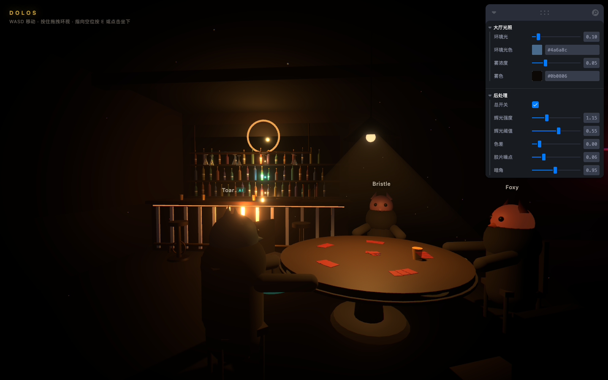
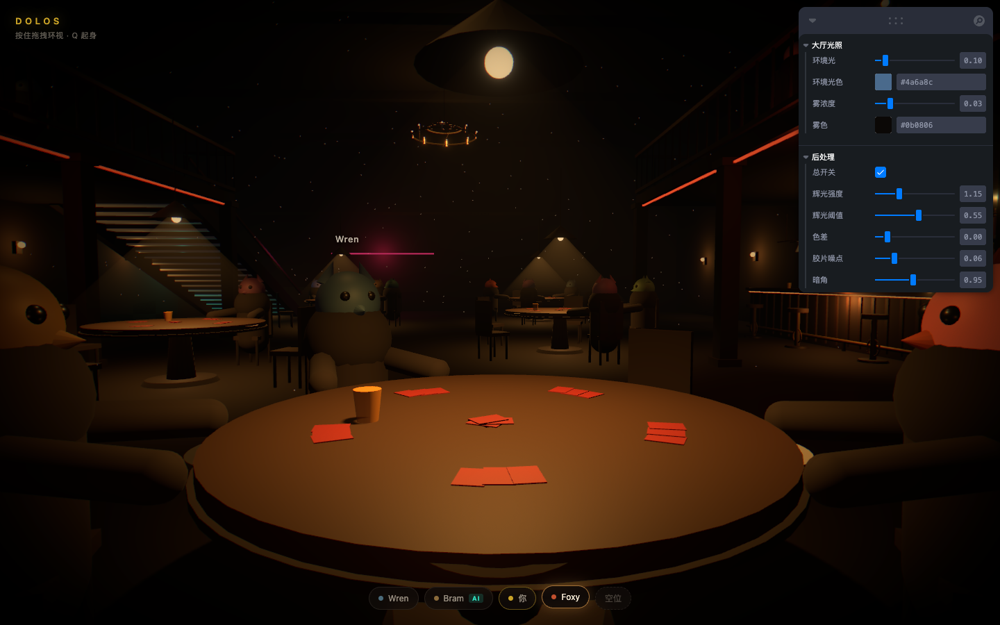
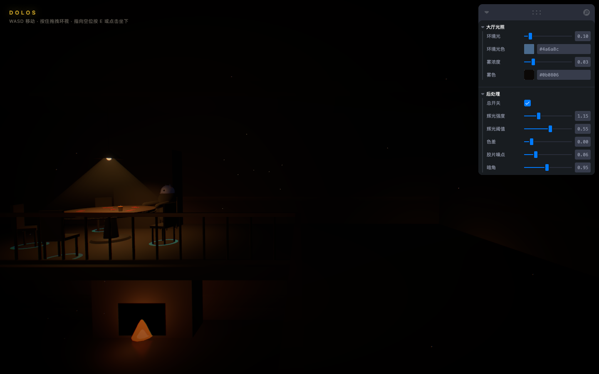
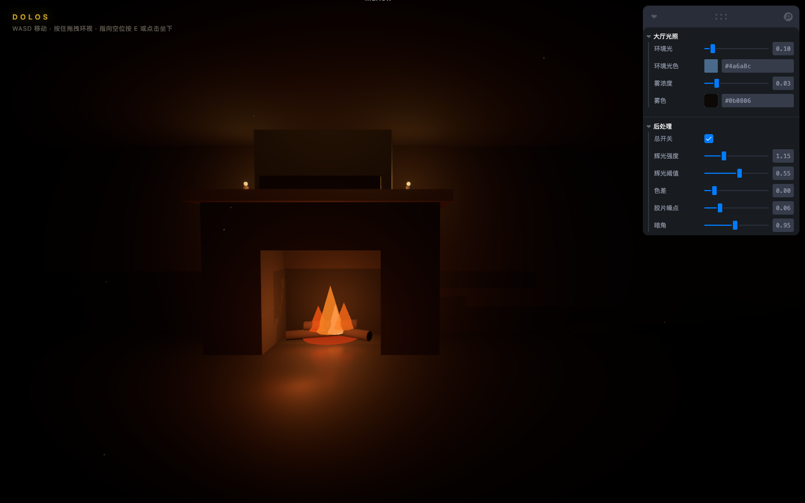

# Dolos

> Δόλος —— 诡计与欺瞒之灵，普罗米修斯的学徒，造过一尊以假乱真的雕像。

撒谎酒馆风格的第一人称语音牌桌。目标是一个带大厅和房间、可以加 AI 补位的
在线社交推理游戏。

空间是一间两层的长条酒馆：一层从南端入口一路铺到北端壁炉，吧台贴西墙、
藏在二楼挑台底下；二层是沿东西北三面的 U 形挑台，中间通高成中庭。
**站在挑台上能俯瞰楼下整桌人** —— 上下贯通的中庭是"这是个地方"而不是
"这是个场景"的主要来源。

**当前状态：纯前端视觉原型，数据全是 mock。** 没有服务端、没有 WebSocket、
没有真实语音。存在的意义是先摸清前端视觉的上限——质感不好，玩家看完就退出去了。






```bash
npm install
npm run dev
```

## 玩法

点击进入（这一下同时申请指针锁定）→ `WASD` 移动、**鼠标直接转视角不用按住**、
`Shift` 跑 → **走到空椅子旁边就会自动选中最近那把**，`E` 坐下 → `Q` 起身。

坐下时指针自动解锁，牌桌上用光标；起身时自动锁回去。按 `Esc` 被浏览器解锁后，
点一下画面继续。

**手感参数在 leva 的「手感」里可调**：走路速度、奔跑倍率、鼠标灵敏度、
头部晃动（晕 3D 可以直接拉到 0）。

东侧有一跑直梯通二层，走上去就行，没有额外按键。二层三桌留的空位更多 ——
爬那趟楼梯得有回报。

## 先做这两件事

**1.** 右上角 leva 面板里把 **后处理 → 总开关** 关掉再打开。同样的几何体，
关掉是一坨灰塑料，打开是一间酒吧。氛围的七成在后处理里，不在建模里。

**2.** 拖 **大厅光照 → 环境光**，往上拖一点点画面立刻垮掉。主光和环境光的
比值才是戏剧性的来源，宁可暗，不要平——暗部该由霓虹的彩色补光去填，
而不是靠白色环境光提亮。

## 骨架里刻意做对的几件事

**音频和画面之间只有一个接缝**

`src/audio/amplitudes.ts` 是一个模块级的 Map，键是 `tableId:seat`。
fakeDriver（本地假说话数据）和 webrtcDriver（真实音轨走 AnalyserNode 算 RMS）
都往里写，3D 场景从里面读。接真语音时只改一行：

```diff
  // src/scene/Scene.tsx
- useEffect(() => startFakeDriver(), [])
+ useEffect(() => startWebRTCDriver(), [])
```

然后在拿到远端音轨时 `attachStream(tableId, seat, stream)`。场景代码一行不动。

**每帧变化的数据不走 React**

音量每帧都在变，走 `useState` 会让整棵树每帧重渲染。角色在 `useFrame` 里直接读
那块内存；只有「谁在说话」这种低频状态才降频写进 zustand 给 HUD 用。
这是 R3F 项目最容易写错、也最容易在多桌多路音频下炸掉的地方。

**相机只有一个所有者**

走动、坐下转场、落座环视三种行为全在 `PlayerRig` 里。多个组件同时写
`camera.position` / `camera.rotation` 会互相打架，而且 bug 极难查。

**移动手感：绕了三版才回到最标准的方案**

值得完整记下来，因为教训不在参数上，在方向上。

起点是一个合理的诉求：按住鼠标才能转视角，走远路很累。
于是我去掉了鼠标依赖，让键盘独立控制方向，前后试了三版：

1. **WASD 改成世界方向 + 镜头自动追移动方向** —— 方向感很不准。
   问题在过渡期：朝北站着按 D，人立刻往东走，镜头却要半秒才转过来，
   那半秒里按键方向和屏幕上的"前"对不上。而且第一人称根本没有"北"的视觉锚点。
2. **坦克式，A/D 转向** —— 方向准了（实测偏差 0.0000 rad），
   但丢掉侧移之后，在满是桌子的厅里挪半米要"转身-走-再转回来"。
3. **WASD 侧移 + 方向键转向** —— 能用，但还是不如 FPS 顺手。

然后去查了撒谎酒馆到底怎么做的，答案是**最标准的那一套**：
WASD 相对镜头移动、**鼠标锁定后直接转视角不用按住**、Shift 跑、
走到桌边按 `E` 坐下。

**真正的问题从一开始就不是"怎么让键盘转向"，而是我不该拿掉自由鼠标视角。**
而我拿掉它，是为了保住"光标 hover 椅子"这个选座方式 ——
一个次要交互，把主要手感的上限锁死了，后面三版全是在给这个自找的限制打补丁。

解法是把两件事拆开：撒谎酒馆的选座**根本不用瞄**，走到桌边按 E 就行。
所以选座改成按距离自动选中最近的空椅子，光标就彻底不需要了，
鼠标可以专心做它在 FPS 里唯一该做的事。

教训：**当你连续几版都在调参数却调不好手感时，先怀疑约束本身是不是自己加的。**

自动转向只在**点击寻路**时生效 —— 用键盘走的时候玩家自己在掌舵，
镜头再去抢方向就会打架。朝向也只在速度超过阈值时更新，
否则速度趋近 0 时方向向量剧烈抖动，每次停步镜头都会甩一下。

**头部晃动的翻滚原本写成了半频**（`cos(phase * 0.5)`），左右摇的周期是上下起伏的
两倍，走起来像喝多了在踉跄。真实步态里两者同频（每一步一次起伏、一次侧倾），
改成同频并压小了幅度。这类"说不上哪不对但就是难受"的问题，
往往就藏在这种周期关系里。

**走动锁指针，落座解锁**

走动是标准 FPS，必须锁指针才有自由鼠标视角；牌桌上要用光标点牌点按钮，必须解锁。
坐下转场的第一帧就 `exitPointerLock()`，按 `Q` 起身时在按键回调里直接
`requestPointerLock()` —— 必须在用户手势里同步调用，浏览器不接受无手势的锁定请求。

坐下时 FOV 从 72 收到 60，那一下镜头收拢是「坐下」这个动作里很关键的一半。

**选座按距离，不用瞄。** 每 5 帧找一次范围内最近的空椅子，
背后的（与视线夹角过大）不选，否则贴着桌子转身时选中项会乱跳。

**上下楼用高度场，不用物理引擎**

玩家有了 Y 轴之后，最省事也最稳的做法是一个纯函数
`floorHeightAt(x, z, level)`：在楼梯范围内返回斜坡高度，在二层且落在挑台
矩形内返回 3.5，其余一律返回 0。再加**一条**规则——一步迈不过 0.45 米就
拒绝这次位移。

这一条规则同时挡掉了全部边界情况：走出挑台（脚下突然变 0，落差 3.5）、
从楼下直接窜上楼梯顶（落差 3.46）、翻过栏杆掉进中庭。不需要给每种情况
单独摆碰撞体，也不需要射线往下打。楼层则直接由高度反推，楼梯走过半就算上去了。

位移被拒绝时会退化成只走一个轴，这样贴着墙和栏杆走会"滑"过去而不是黏住。

**动物头套是工程决策，不只是风格**

刚性面具 = 不需要面部绑定、不需要 blendshape、不需要口型同步，还绕开了恐怖谷。
所有表达压到肢体语言上：头部点动、身体前倾、面具随音量自发光。

**只给最近的两张桌子开实时阴影**

`ShadowBudget` 每 20 帧按距离重排。每盏 castShadow 的聚光灯都是一次额外的
场景渲染，四桌全开会明显掉帧，而三米开外的阴影根本看不清。

## 性能：一次实测

做完二层之后掉到 **9.7 FPS**（一帧 103ms）。逐项关掉来定位：

| | FPS |
|---|---|
| 原始 | 9.7 |
| 关掉 36 盏点光源 | **52.5** |
| 再关掉 8 盏聚光灯 | 64.3 |
| 只关反射地板 | 10.0（几乎无变化） |
| 只关后处理 | 11.2（几乎无变化） |

**全部代价在灯上，反射地板和后处理近乎免费。** 直觉会先怀疑后处理和反射，
实际它们加起来只值 1 FPS —— 这就是为什么要量而不是猜。

根因是"每加一件家具就顺手挂一盏灯"，堆到了 46 盏。three 里每一盏动态光
都要对每个像素算一遍，灯的数量是这类场景最容易失控、也最贵的一项。

修法三条：

1. **纯装饰的灯全删。** 蜡烛、霓虹、酒柜上下两层——这些只是"要被看见"，
   不是"要照亮东西"，自发光材质 + Bloom 就够，一盏真光源都不需要。
2. **光源预算**（`src/scene/LightBudget.tsx`）：只点亮离玩家最近的 8 盏点光源
   和 4 盏聚光灯。关键细节是**可见盏数必须恒定**——three 按灯的数量编译着色器，
   数量一变就重编译，走动时会一顿一顿。换灯不换数量就不会触发。
3. **八盏"桌下反弹光"直接删掉**，环境光从 0.10 提到 0.16 补回来。一盏抵八盏。

灯修完到 55 FPS，此时瓶颈变成 **3496 draw call/帧**。酒瓶是大头：
111 只 × 5 个 mesh = 555 个，占全场三分之一。改成 `latheGeometry` 一次成型
（一只瓶子一个 mesh，肩部还更平滑），再对整个酒柜做距离剔除。

**最终 70.8 FPS，一帧 14.1ms** —— 从 103ms 降了 7.3 倍。

### 然后把灯加回去了

第一版修复里我顺手删掉了一批灯，结果画面明显发平 —— **删错了对象**。
被删的里面有霓虹那几盏，它们负责把粉/青/红**染到墙面和地板上**；
自发光条只是自己亮，不会给周围上色，那层色彩渗透没了整个画面就垮一档。

有了预算系统之后这个取舍根本不需要做：**场景里挂多少盏灯几乎不影响帧率，
只有上限值才要钱。** 所以全加回来了，现在场景里有 48 盏可调度的灯，
同时只点 14 盏。leva 面板里的「光源预算」可以实时拖：

| 点光源上限 | FPS |
|---|---|
| 8 | 65 |
| 12 | 66.6 |
| **14（默认）** | **67** |
| 18 | 57.6 |
| 24 | 30.6 |
| 40 | 9.6 |

曲线在 14 附近有个明显的膝盖：**到这儿之前基本免费，过了就开始塌。**
氛围灯该加就加，只要都挂上 `userData={{ budget: 'point' }}`。

## 踩过的坑（别再踩一遍）

**楼梯疯狂闪烁 = 深度冲突（z-fighting），不是性能问题。** 症状很有辨识度：
静止时正常，**一转视角就闪**。原因是踏板和踢面被我做得严丝合缝，造出了三组
完全共面的表面（踢面顶 = 踏板顶、踢面前脸 = 踏板前脸、踏板侧面 = 梯帮内侧）。
共面的两个面在 GPU 眼里深度完全相同，每个像素靠浮点误差决定谁在前，
镜头一动就来回翻。修法是让实体**互相插进去一两厘米**而不是刚好贴合。
同类隐患：挑台楼板的贴面只抬高了 2mm，掠射角下同样不够分辨，已改成 8mm。

**three 不认 8 位十六进制颜色，会静默变白。** `color="#33221600"` 本意是
`#332216`，多打了两位。three 的解析只认 3 位和 6 位，其余长度只发一条
控制台警告然后保持默认色（白），于是楼梯踏板一直是亮白的，
在一个全场都是暗木色的场景里格外刺眼。写死的色值值得扫一遍位数。

**移动方向绕 Y 轴旋转的符号写错，W/S 整个颠倒。** 正确形式是
`x' = vx*cos + vz*sin`、`z' = -vx*sin + vz*cos`，当时两个 `vz` 项都写成了减号。
阴险的地方在于 **A/D 完全正常**——纯左右平移时 `vz = 0`，那两项被乘没了，
所以一半的输入是对的，掩盖了另一半是反的。改动这类旋转公式时，
四个方向要一个一个代进去验，别只试一个。

**透明命中体不能用 `visible={false}`。** three 的 Raycaster 会跳过
`visible === false` 的对象，R3F 的指针事件因此永远收不到。
要用 `transparent + opacity={0}` 让它保持"可见但看不见"。

**光锥着色器吐 NaN，整个画面全黑。** 圆锥顶点处四周的法线在插值中相互抵消，
长度趋近 0，`normalize()` 产出 NaN。而 NaN 在 HDR 管线里会传染——Bloom 的
mipmap 降采样把这一个像素抹遍全图。最阴的地方是 **`NaN * 0` 仍是 `NaN`**，
所以把所有后处理强度调成 0 也救不回来，看起来就像「后处理坏了」。
修法是 `safeNormalize()` 加长度兜底。见 `src/scene/hall/LightShaft.tsx`。

**`import.meta.env` 需要 `vite/client` 类型。** tsconfig 里显式写了 `types`
数组的话，会覆盖默认行为，必须手动加进去。

**TS 5.7+ 收紧了 TypedArray 泛型**，`getByteTimeDomainData` 不接受
SharedArrayBuffer 背书的数组。用 `ReturnType<typeof makeBuf>` 推导，
新旧 TS 都能编过。见 `src/audio/webrtcDriver.ts`。

## 目录

```
src/
  audio/
    amplitudes.ts     音量寄存器 —— 声音和画面唯一的接缝
    fakeDriver.ts     假说话数据，零配置看效果。上线前删掉
    webrtcDriver.ts   真实音轨 → AnalyserNode → RMS
  player/
    PlayerRig.tsx     相机的唯一所有者：走动 / 转场 / 落座
    SeatPicker.tsx    坐下 / 起身的键盘处理（选座已交给 R3F 指针事件）
  scene/
    hallLayout.ts     大厅与座位布局，所有位置的唯一真相来源
    Scene.tsx         场景装配 + 阴影预算
    Character.tsx     胶囊体角色，音量驱动动作
    Lighting.tsx      大厅级光照与雾
    Effects.tsx       后处理栈
    hall/
      Hall.tsx        地板（反射）、墙、吧台、壁炉、壁灯、吊灯、霓虹
                      吧台 = 台身竖木条 / 包边台面 / 脚踏铜杆 / 吧凳 /
                      三层带背光的酒柜 / 倒挂玻璃杯架
      Mezzanine.tsx   二层楼板 / 栏杆 / 楼梯 / 支撑柱
      TableUnit.tsx   一张桌子的全部：桌体 / 吊灯 / 椅子 / 人 / 牌
      Seat.tsx        椅子 + 命中体 + 空位指示光圈
      LightShaft.tsx  假体积光锥
      DustMotes.tsx   空气浮尘
  state/
    useGameStore.ts   桌子占用情况（mock）
    usePlayerStore.ts 玩家模式状态机
  ui/Hud.tsx          进场页、同桌玩家列表（坐下提示在 Seat.tsx 里，贴在椅子上）
```

开发期控制台里有 `window.__dolos`，可以直接驱动和检查状态：

```js
__dolos.player.getState().beginSit({ tableId: 't4', seat: 1 })
__dolos.game.getState().occupancy
__dolos.scene   // three.js scene
__dolos.camera
```

## 游戏引擎（无头，`src/game/`）

**当前状态：规则引擎完成，LLM agent 待接。**

```bash
npm run game                              # 批量自我对弈，出统计
npm run game -- --players 7 --games 5000
npm run game -- --trace --seed 3          # 跑一局，打印完整过程
```

跑在命令行里，**一行 3D 都不碰**。存在的意义是在服务端、语音、AI 之前
先回答一个问题：这个游戏到底成不成立、agent 到底会不会玩。

规则 bot 自我对弈的基线（各 4000 局）：

| | 好人胜率 | 好人过三轮 | 刺客命中 | 随机基准 |
|---|---|---|---|---|
| 5 人 | 51.4% | 73.4% | 30.0% | 33.3% |
| 7 人 | 48.7% | 64.5% | 24.5% | 25.0% |
| 10 人 | 30.9% | 35.5% | 13.0% | 16.7% |

5/7 人局落在公开统计的 ~50% 区间；刺客命中率贴着随机基准，
因为基线**刻意不建模欺骗** —— 那块空间留给 LLM 去证明自己。

### 三个结构性决定

**隐藏信息靠类型钉死。** `GameState`（含 roles）只存在于服务端，
对外唯一出口是 `project(state, playerId) → PlayerView`。
最常见的致命错误是把完整 state 广播出去、让前端负责"不显示" ——
那等于把梅林是谁写在网络帧里，F12 就赢了。

**可见性是一张表不是一串 if。** 莫德雷德对梅林隐身、奥伯伦对同伙也隐身、
派西维尔看到两个人但分不清谁是谁 —— 例外套例外，写成 if 迟早错。

**状态 = fold(事件)。** 重连、回放、AI 上下文、纠纷复盘全部复用同一条事件流，
不需要额外代码路径。

### 两个实测出来的坑

**投影漏了历史，好人胜率只有 2.2%。** 好人在阿瓦隆里唯一的硬信息是
"谁上过失败的任务"，而我最初的 `PlayerView` 没有历史队伍记录 ——
等于让好人闭着眼睛玩。补上之后好人过三轮的比例从 2.7% 跳到 73%。
**LLM 拿到同样残缺的视图会一样瞎**，这类问题在接 AI 之前就该暴露。

**基线一度对自己过拟合。** 刺客曾用"谁最常否决己方队伍"来找梅林，
命中率 95% —— 但它利用的是**我自己写的梅林**才有的破绽（毫无隐藏地精确否决）。
两边都是我的代码，测出来的数字没有意义。基线的职责是当尺子，不是自己赢，
所以改成随机猜，并把刺杀单独列成一个指标。

## 下一步

1. **状态驱动的动画编排**——出牌、翻牌、投票。全是位置动画，不需要骨骼。
   这一步会暴露真正的难点：服务端事件到了，但上一个动画还没播完怎么办。
2. **接 WebSocket**，让 store 由服务端事件驱动而不是 mock。
3. **接 WebRTC**，换掉 fakeDriver。
4. **最后**才换 glTF 模型。倒过来做（先啃模型）是单人项目最常见的死法。

## 已知的偷懒 / 待决策

- **5 人以上圆桌 + 第一人称，侧面玩家必然出画。** 撒谎酒馆只有 4 人所以不明显，
  阿瓦隆最少 5 人。要么减到 4 人一桌，要么把座位排成弧形而不是整圆。**这个越晚改代价越大。**
- 二层挑台宽 5 米，放下桌椅后过道偏窄，绕桌走会蹭到栏杆。
- 高度场是纯 2D 查询，所以**同一处平面不能有上下两个可走的面**。
  目前挑台底下的一层是靠"玩家当前在哪层"这个状态区分的，只有楼梯一个连接点
  所以成立；将来要加第二部楼梯或者电梯，这套就得换成真正的分层导航。
- 落座后看不到自己的手和牌。
- 静态几何体的光照应该在 Blender 里烤成贴图，现在全是实时的。
- 移动端没测。WebGL + 多路 WebRTC 音频解码在中端手机上会烫，需要一个
  关掉全部后处理的低画质档。
- 打包 1.27MB（gzip 363KB），没做代码分割。
