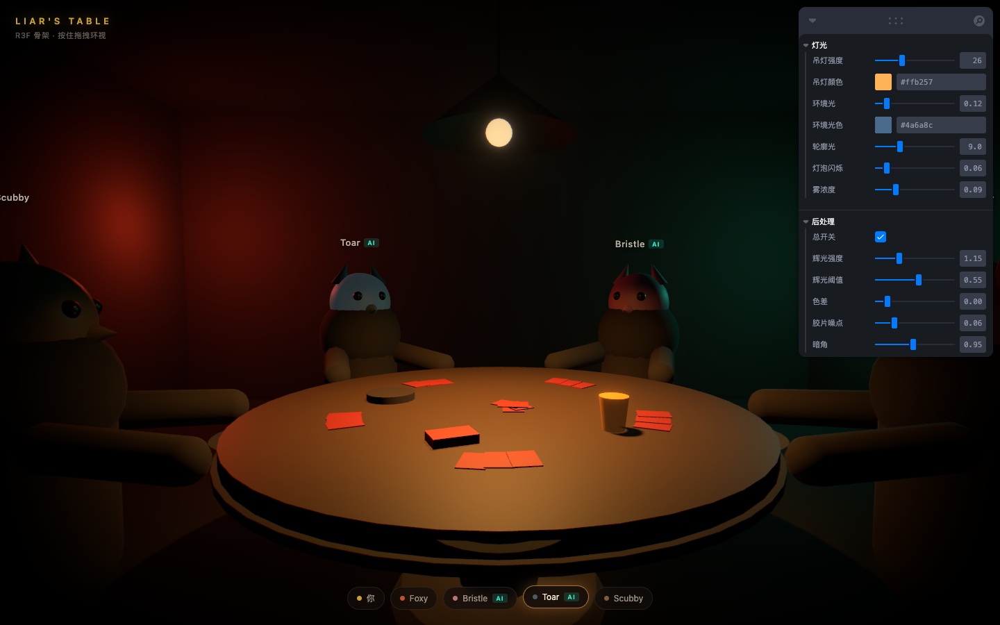

# Dolos

> Δόλος —— 诡计与欺瞒之灵，普罗米修斯的学徒，造过一尊以假乱真的雕像。

撒谎酒馆风格的第一人称语音牌桌。目标是一个带大厅和房间、可以加 AI 补位的
在线社交推理游戏；**当前仓库里只有场景骨架**，用来验证一件事：
在完全没有美术资产的情况下，光照 + 后处理能把一堆胶囊体推到什么程度。



```bash
npm install
npm run dev
```

## 先做这一件事

打开页面，右上角 leva 面板里把 **后处理 → 总开关** 关掉再打开。

同样的几何体，关掉是一坨灰塑料，打开是一间酒吧。这就是「氛围的七成在后处理里，
不在建模里」的意思。接着再拖 **灯光 → 环境光**，往上拖一点点画面立刻垮掉——
主光和环境光的比值才是戏剧性的来源，宁可暗，不要平。

## 骨架里刻意做对的几件事

**1. 音频和画面之间只有一个接缝**

`src/audio/amplitudes.ts` 是一块模块级的 `Float32Array`。两个 driver 往里写，
3D 场景从里面读。接真 WebRTC 时只改一行：

```ts
// src/scene/Scene.tsx
- useEffect(() => startFakeDriver(), [])
+ useEffect(() => startWebRTCDriver(), [])
```

然后在拿到远端音轨时 `attachStream(seat, stream)`。场景代码一行不动。

**2. 每帧变化的数据不走 React**

音量每帧都在变，走 `useState` 会让整棵树每帧重渲染。`Character` 在 `useFrame`
里直接读那块内存。只有「谁在说话」这种低频状态才降频写进 zustand 给 HUD 用。
这是 R3F 项目最容易写错、也最容易在 5 个人 + 5 路音频时炸掉的地方。

**3. 相机不用 PointerLock**

牌桌游戏要点牌、点按钮、点玩家，锁指针会让 UI 完全没法用。改成按住拖拽环视，
视角夹在左右 ±75°、上 18° 下 32°——你是坐着的，不该能转 360°。
这个限制反而强化了「被困在这张桌子上」的感觉。

**4. 动物头套不是风格，是工程决策**

刚性面具 = 不需要面部绑定、不需要 blendshape、不需要口型同步，还绕开了恐怖谷。
所有表达压到肢体语言上：头部点动、身体前倾、面具自发光。撒谎酒馆用的就是这一招，
省下的美术工作量是巨大的。

## 目录

```
src/
  audio/
    amplitudes.ts     音量寄存器 —— 声音和画面唯一的接缝
    fakeDriver.ts     假说话数据，零配置看效果。上线前删掉
    webrtcDriver.ts   真实音轨 → AnalyserNode → RMS
  scene/
    seats.ts          座位布局，所有位置的唯一真相来源
    Scene.tsx         场景装配
    CameraRig.tsx     坐姿第一人称，拖拽环视 + 呼吸摇晃
    Character.tsx     胶囊体角色，音量驱动动作
    Room.tsx          房间、桌子、吊灯、牌、说话指示环
    Lighting.tsx      布光（氛围的地基）
    Effects.tsx       后处理栈（氛围的七成）
  state/useGameStore.ts   玩家列表 + 当前说话人
  ui/Hud.tsx              2D UI，和 3D 吃同一个 store
```

## 下一步的顺序

1. **状态驱动的动画编排** —— 出牌、翻牌、投票。全是位置动画，不需要骨骼。
   这一步会暴露真正的难点：服务端事件到了，但上一个动画还没播完怎么办。
2. **接 WebSocket**，让 `useGameStore` 由服务端事件驱动而不是写死的 PRESET。
3. **接 WebRTC**，换掉 fakeDriver。
4. **最后**才换 glTF 模型。倒过来做（先啃模型）是单人项目最常见的死法。

## 已知的偷懒

- 本地玩家（座位 0）不渲染身体，相机就在他脑袋里。以后要加自己的手和牌。
- 侧面两个座位会有一半在画面外，需要转头才看得全。这是 5 人圆桌 + 第一人称的
  固有问题，撒谎酒馆只有 4 人所以不明显。要么减到 4 人，要么把座位排成扇形而不是整圆。
- 实时阴影只有吊灯那一盏。真做美术时这些静态物体的光照应该在 Blender 里烤成贴图。
- 移动端没测。WebGL + 多路 WebRTC 音频解码在中端手机上会烫，需要一个关掉全部
  后处理的低画质档。
```
